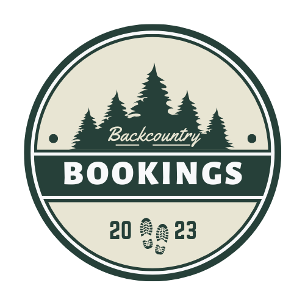

# Backcountry Bookings

### Learning Goals:
- Use an agile process to turn well defined requirements into deployed and production ready software
- Gain experience dividing applications into components and domains of responsibilities to facilitate multi-developer teams. Service oriented        architecture concepts and patterns are highly encouraged.
- Explore and implement new concepts, patterns, or libraries that have not been explicitly taught while at Turing (Typescript)
- Gain experience using continuous integration tools to build and automate the deployment of features
- Build applications that execute in development, test, CI, and production environments
- Focus on communication between front-end and back-end teams in order to complete and deploy features that have been outlined by the project spec

### Abstract:
 
Welcome to Backcountry Bookings - your ultimate destination for all your camping needs! Our website is a comprehensive conglomerate of campsite information from around the country, designed to provide campers with an easy-to-navigate and reliable platform for finding the perfect campsite for their outdoor adventures.

### Installation Instructions:
- Fork the repository found here: https://github.com/Backcountry-Bookings/backcountry_fe
- Clone down your new, forked repo. While cloning, name it what you want your local repo to be named, and run git clone.
- cd into the repository
- Install NPM packages by running npm install in your terminal
- Start the server by running npm start in your repo
- After starting the server, the project will run at http://localhost:3000/

-Additionally, this complete project has been deployed on heroku: https://backcountrybookings.herokuapp.com/

### Preview of App:

### Context:
Ryan, Craig, Rick, and Colin worked on this project for 16 days. We are all in our 3rd week in our fourth module in Turing. 

### Contributors:
- [Ryan Baer (he/him)](https://www.linkedin.com/in/ryan-baer-33311114a/)
- [Craig Weller (he/him)](https://www.linkedin.com/in/craig-weller/)
- [Rick Vermeil (he/him)](https://www.linkedin.com/in/rick-vermeil-b93581159/)
- [Colin Ciervo (he/him)](https://www.linkedin.com/in/colin-ciervo-8b085a1b6/)

### Wins + Challenges:
Some challenges included: 
- Working with importing files and sending them to the backend. Specifically how to utilize form data to send files when posting reviews and their images.
- Working with Typescript while doing a project. As a strictly typed language, attention to detail is crucial to the utilization of Typescript and while it effectively reduced the amount of bugs it generally took longer to build.

Some wins included:
- Implementing Typescript correctly. There is zero use of "any" across all Typescript files. 
- Implementing Google Maps. As a relevent piece to any modern web app, it was very beneficial to learn how to utilize it during this project. 
- Effective use of Sass. This helped to enforce styling patterns and cut down on the lines of code and complexity of our CSS files. 
